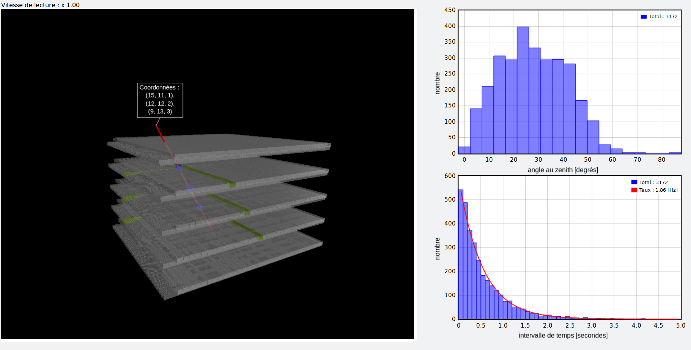

The software is part of an outreach project for "Nuit de la Science" 2018, Geneva Switzerland.



# Clone the project

```
git clone https://github.com/calispac/muon-telescope
cd muon-telescope
```

# Installation
The software should run on recent Linux, MacOS and Windows machine.
It is recommanded to have a graphical card
## Install Miniconda

Follow the installation instruction at this page :

https://conda.io/docs/user-guide/install/index.html

## Create the `conda` muon-telescope environment


```
conda env create -f environment.yml
```

# Use the software

Do this only once.
```
source activate muon-telescope
```

Then

```
python viewer.py
```

## Keyboard usage

- `Delete` --> Show/Hide track
- `Up` --> Increase frame rate
- `Down` --> Decrease frame rate
- `Backspace` --> Pause/Resume

## Mouse usage

- Hold left click --> rotate the frame
- Scroll --> zoom in/out